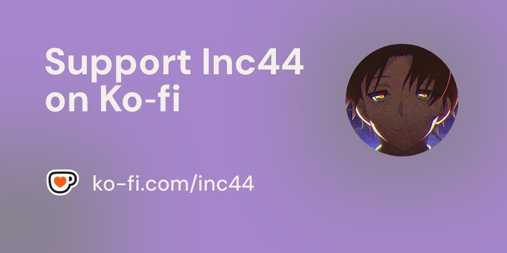

[I'll do it later](https://inc44.github.io/blog/templates)

[I am using it now](https://inc44.github.io/CoFlu)

#### *My "passion" is surviving an 80-hour week from Monday to Saturday.*
But hey, I still have time for my projects!

- **MaTools** — for when you need to “organize” files (hide them).
- **CoFlu** — to fix typos because, apparently, grammar is a social construct.
- **And Rust?** That’s my “spinning donut of doom,” faster than your WiFi.

#### Contributions?
On my way to **1,500**. Basically a part-time job.
But hey, it’s not about making a difference—it’s about the *illusion* of productivity.

#### My stars?
Proof I’m not alone in this madness.

P.S. *This text is proudly sponsored by my 5-minute break from existential dread.*

#### Support?

